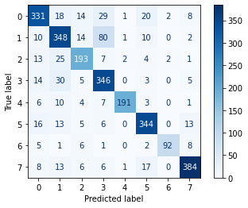

# Machine Learning


```python
import pandas as pd
import pandas as pd
import numpy as np

from sklearn.feature_extraction.text import CountVectorizer
from sklearn.model_selection import train_test_split

from sklearn import preprocessing
from sklearn import metrics


from sklearn.datasets import fetch_20newsgroups

from sklearn.naive_bayes import MultinomialNB
from sklearn.pipeline import Pipeline

from sklearn.metrics import plot_confusion_matrix
```


```python
df = pd.read_csv("../EDA/ml_csv.csv")
df.drop(columns="Unnamed: 0", axis=1, inplace=True)
df
```


<div>
<style scoped>
    .dataframe tbody tr th:only-of-type {
        vertical-align: middle;
    }

    .dataframe tbody tr th {
        vertical-align: top;
    }

    .dataframe thead th {
        text-align: right;
    }
</style>
<table border="1" class="dataframe">
  <thead>
    <tr style="text-align: right;">
      <th></th>
      <th>category</th>
      <th>merged_text</th>
    </tr>
  </thead>
  <tbody>
    <tr>
      <th>0</th>
      <td>politics</td>
      <td>['mary', 'trump', 'slam', 'susan', 'sarandon',...</td>
    </tr>
    <tr>
      <th>1</th>
      <td>politics</td>
      <td>['moment', 'two', 'ukrainian', 'fighter', 'jet...</td>
    </tr>
    <tr>
      <th>2</th>
      <td>politics</td>
      <td>['mark', 'esper', 'whats', 'stake', 'donald', ...</td>
    </tr>
    <tr>
      <th>3</th>
      <td>politics</td>
      <td>['hunter', 'biden', 'enlists', 'hollywood', 'm...</td>
    </tr>
    <tr>
      <th>4</th>
      <td>politics</td>
      <td>['president', 'trump', 'response', 'mark', 'es...</td>
    </tr>
    <tr>
      <th>...</th>
      <td>...</td>
      <td>...</td>
    </tr>
    <tr>
      <th>9016</th>
      <td>food</td>
      <td>['classic', 'tater', 'tot', 'casserole', 'gree...</td>
    </tr>
    <tr>
      <th>9017</th>
      <td>food</td>
      <td>['stew', 'south', 'india', 'know', 'different'...</td>
    </tr>
    <tr>
      <th>9018</th>
      <td>food</td>
      <td>['biscuit', 'self', 'rise', 'flour', 'biscuit'...</td>
    </tr>
    <tr>
      <th>9019</th>
      <td>food</td>
      <td>['streusel', 'top', 'banana', 'bread', 'exampl...</td>
    </tr>
    <tr>
      <th>9020</th>
      <td>food</td>
      <td>['fresh', 'summer', 'drink', 'refresh', 'look'...</td>
    </tr>
  </tbody>
</table>
<p>9021 rows × 2 columns</p>
</div>


```python
df["category"].value_counts()
category_list = df["category"].unique()

df['category_id'] = df['category'].factorize()[0]

df
```


<div>
<style scoped>
    .dataframe tbody tr th:only-of-type {
        vertical-align: middle;
    }

    .dataframe tbody tr th {
        vertical-align: top;
    }

    .dataframe thead th {
        text-align: right;
    }
</style>
<table border="1" class="dataframe">
  <thead>
    <tr style="text-align: right;">
      <th></th>
      <th>category</th>
      <th>merged_text</th>
      <th>category_id</th>
    </tr>
  </thead>
  <tbody>
    <tr>
      <th>0</th>
      <td>politics</td>
      <td>['mary', 'trump', 'slam', 'susan', 'sarandon',...</td>
      <td>0</td>
    </tr>
    <tr>
      <th>1</th>
      <td>politics</td>
      <td>['moment', 'two', 'ukrainian', 'fighter', 'jet...</td>
      <td>0</td>
    </tr>
    <tr>
      <th>2</th>
      <td>politics</td>
      <td>['mark', 'esper', 'whats', 'stake', 'donald', ...</td>
      <td>0</td>
    </tr>
    <tr>
      <th>3</th>
      <td>politics</td>
      <td>['hunter', 'biden', 'enlists', 'hollywood', 'm...</td>
      <td>0</td>
    </tr>
    <tr>
      <th>4</th>
      <td>politics</td>
      <td>['president', 'trump', 'response', 'mark', 'es...</td>
      <td>0</td>
    </tr>
    <tr>
      <th>...</th>
      <td>...</td>
      <td>...</td>
      <td>...</td>
    </tr>
    <tr>
      <th>9016</th>
      <td>food</td>
      <td>['classic', 'tater', 'tot', 'casserole', 'gree...</td>
      <td>4</td>
    </tr>
    <tr>
      <th>9017</th>
      <td>food</td>
      <td>['stew', 'south', 'india', 'know', 'different'...</td>
      <td>4</td>
    </tr>
    <tr>
      <th>9018</th>
      <td>food</td>
      <td>['biscuit', 'self', 'rise', 'flour', 'biscuit'...</td>
      <td>4</td>
    </tr>
    <tr>
      <th>9019</th>
      <td>food</td>
      <td>['streusel', 'top', 'banana', 'bread', 'exampl...</td>
      <td>4</td>
    </tr>
    <tr>
      <th>9020</th>
      <td>food</td>
      <td>['fresh', 'summer', 'drink', 'refresh', 'look'...</td>
      <td>4</td>
    </tr>
  </tbody>
</table>
<p>9021 rows × 3 columns</p>
</div>


### Pipeline
In order to make this flow easier to work with:  

`scikit-learn` package provides a `Pipeline` class that behaves like a compound classifier:


```python
x = df["merged_text"]
y = df["category_id"]

print(df[df["category_id"] == 1].iloc[0])
x_train, x_test, y_train, y_test = train_test_split(x, y, test_size=0.3, random_state=42)
text_clf = Pipeline([('vect', CountVectorizer()), ('clf', MultinomialNB())])
    
model = text_clf.fit(x_train, y_train)
y_pred = model.predict(x_test)
dis = plot_confusion_matrix(model, x_test, y_test, cmap="Blues", values_format=".3g")

```

    category                                              technology
    merged_text    ['review', 'motorola', 'moto', 'g', 'pure', 'w...
    category_id                                                    1
    Name: 200, dtype: object
    


    

    


```python
from sklearn.metrics import accuracy_score, f1_score, precision_score, recall_score

print(f"accuaracy score: {accuracy_score(y_test,y_pred)}")
print(f"precision_score: {precision_score(y_test,y_pred, average='micro')}")# TP / TP + FP
print(f"recall_score: {recall_score(y_test,y_pred, average='macro')}")# TP / TP + FN
print(f"f1_score: {f1_score(y_test,y_pred, average='weighted')}")# 2*P*R/(P+R)

```

    accuaracy score: 0.8234207609900258
    precision_score: 0.8234207609900258
    recall_score: 0.8225560051008923
    f1_score: 0.824594601354629
    


```python

```
